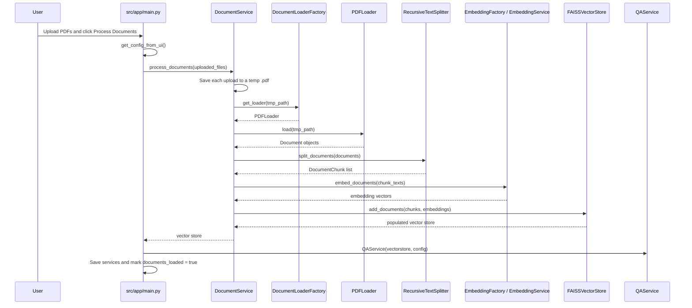
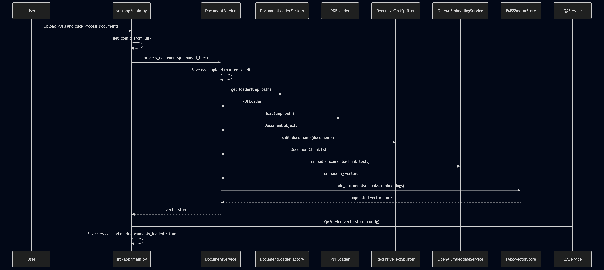
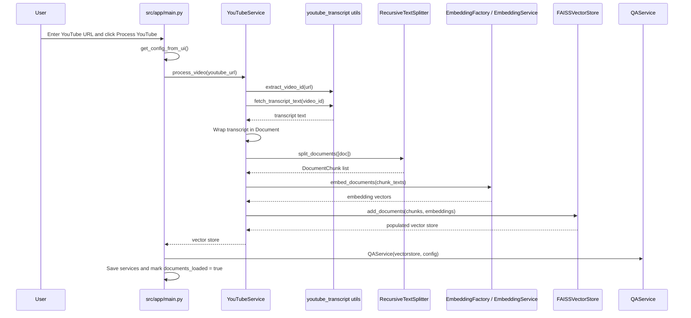
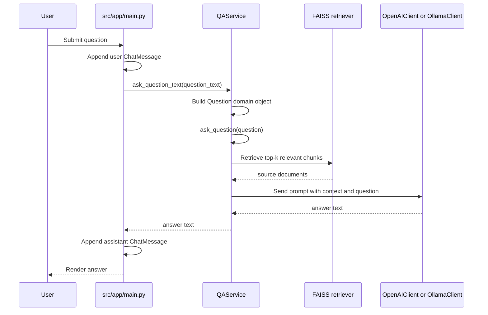

# Control Flow

This document explains how control moves through the app when a user provides a PDF document or a YouTube link and asks a question.

## Entry Points

| Entry point | File | Purpose |
| --- | --- | --- |
| Streamlit UI | `app.py` -> `src/app/main.py` | Browser UI for selecting a source, processing it, and asking questions |
| FastAPI API | `src/controllers/ask_api.py` | HTTP endpoints for one-shot document or YouTube Q&A |

Both entry points use the same service-level pipeline:

```text
source input
  -> processing service
  -> text chunks
  -> selected embedding provider (OpenAI or Ollama)
  -> FAISS vector store
  -> QA service
  -> retrieval QA chain
  -> selected answer model provider (OpenAI or Ollama)
  -> answer
```

## Streamlit Control Flow

`app.py` imports and calls `main()` from `src/app/main.py`.

```text
app.py
  -> src.app.main.main()
      -> initialize_session_state()
      -> render_sidebar()
      -> render_upload_tab()
      -> render_qa_tab()
```

### 1. App Initialization

`initialize_session_state()` prepares the state that Streamlit keeps between reruns:

| Session key | Purpose |
| --- | --- |
| `document_service` | Current `DocumentService` instance for uploaded PDFs |
| `youtube_service` | Current `YouTubeService` instance for a processed video |
| `qa_service` | Current `QAService` instance connected to the latest vector store |
| `documents_loaded` | Boolean gate that enables the question tab |
| `config` | Current `AppConfig` |
| `messages` | Chat history rendered in the question tab |
| `feature` | Selected source type: `Documents` or `YouTube` |
| `vectorstore` | Current in-memory FAISS vector store |
| `qa_llm_signature` | Answer-model settings used by the current `QAService` |
| `source_embedding_signature` | Embedding settings used to create the current vector store |
| `processed_feature` | Source type used to create the current vector store |

`render_sidebar()` collects source type, answer model provider, embedding provider, model names, Ollama base URL, temperature, and the OpenAI API key when OpenAI is selected.

### 2. Document Processing Flow

When the source is `Documents`, the user uploads one or more PDF files and clicks `Process Documents`.




Key files:

| Step | File |
| --- | --- |
| UI event handling | `src/app/main.py` |
| PDF processing orchestration | `src/services/document_service.py` |
| Loader selection | `src/infrastructure/loaders/loader_factory.py` |
| PDF loading | `src/infrastructure/loaders/pdf_loader.py` |
| Chunking | `src/utils/text_splitter.py` |
| Embedding selection | `src/infrastructure/embeddings/embedding_factory.py` |
| OpenAI embeddings | `src/infrastructure/embeddings/openai_embeddings.py` |
| Ollama embeddings | `src/infrastructure/embeddings/ollama_embeddings.py` |
| Vector storage | `src/infrastructure/vectorstores/faiss_store.py` |

### 3. YouTube Processing Flow

When the source is `YouTube`, the user provides a video URL and clicks `Process YouTube`.



Key files:

| Step | File |
| --- | --- |
| UI event handling | `src/app/main.py` |
| YouTube processing orchestration | `src/services/youtube_service.py` |
| Video ID and transcript fetching | `src/utils/youtube_transcript.py` |
| Chunking | `src/utils/text_splitter.py` |
| Embedding selection | `src/infrastructure/embeddings/embedding_factory.py` |
| OpenAI embeddings | `src/infrastructure/embeddings/openai_embeddings.py` |
| Ollama embeddings | `src/infrastructure/embeddings/ollama_embeddings.py` |
| Vector storage | `src/infrastructure/vectorstores/faiss_store.py` |

### 4. Question Answering Flow

After either source is processed, the UI stores the vector store and a `QAService` in `st.session_state`.

If the user changes only the answer model provider or answer model after processing, the UI rebuilds `QAService` with the existing vector store. If the user changes the embedding provider or embedding model, the UI asks the user to reprocess the source because the FAISS index must be created and queried with the same embedding model.

When the user asks a question:



Important details:

| Detail | Behavior |
| --- | --- |
| Retriever size | `config.retrieval_config.k`, default `3` |
| Prompt location | `src/services/qa_service.py` |
| Prompt style | Uses retrieved context, says "I don't know" when answer is unavailable, and keeps the answer concise |
| Chat state | Stored only in Streamlit session state |
| Vector store persistence | In memory only for the current processed source/session |
| Answer model switching | Rebuilds `QAService` against the existing vector store |
| Embedding model switching | Requires source reprocessing |

## FastAPI Control Flow

The API app lives in `src/controllers/ask_api.py`.

At import/startup time, the API creates the FastAPI app and loads `.env`. Model configuration is built per request from form fields so each request can choose OpenAI or Ollama independently.

### `POST /document/ask`

This is a one-shot flow: each request uploads a file, builds a vector store, creates a QA service, answers the question, and returns JSON.

```text
HTTP multipart form:
  file=<uploaded PDF>
  question=<question text>
  api_key=<optional OpenAI key>
  llm_provider=openai|ollama
  llm_model=<answer model name>
  embedding_provider=openai|ollama
  embedding_model=<embedding model name>
  ollama_base_url=http://127.0.0.1:11434

ask_question()
  -> build_config(...)
  -> await file.read()
  -> wrap bytes in BytesIO and set file_like.name
  -> DocumentService(config)
  -> document_service.process_documents([file_like])
  -> QAService(vectorstore, config)
  -> qa_service.ask_question_text(question)
  -> return {"answer": answer}
```

### `POST /youtube/ask`

This is also a one-shot flow: each request fetches the transcript, builds a vector store, creates a QA service, answers the question, and returns JSON.

```text
HTTP multipart form:
  url=<YouTube URL>
  question=<question text>
  api_key=<optional OpenAI key>
  llm_provider=openai|ollama
  llm_model=<answer model name>
  embedding_provider=openai|ollama
  embedding_model=<embedding model name>
  ollama_base_url=http://127.0.0.1:11434

youtube_ask()
  -> validate url is not empty
  -> build_config(...)
  -> YouTubeService(config)
  -> yt_service.process_video(url)
  -> QAService(vectorstore, config)
  -> qa_service.ask_question_text(question)
  -> return {"answer": answer}
```

## Service Responsibilities

| Component | Responsibility |
| --- | --- |
| `DocumentService` | Turn uploaded PDF files into a FAISS vector store |
| `YouTubeService` | Turn a YouTube transcript into a FAISS vector store |
| `QAService` | Turn a question plus vector store into an answer |
| `EmbeddingFactory` | Select OpenAI or Ollama embedding service |
| `OpenAIEmbeddingService` | Generate embeddings for chunks |
| `OllamaEmbeddingService` | Generate local Ollama embeddings for chunks |
| `LLMFactory` | Select OpenAI or Ollama answer model client |
| `OpenAIClient` | Wrap the OpenAI chat model for answer generation |
| `OllamaClient` | Wrap a local Ollama model for answer generation |
| `FAISSVectorStore` | Hold chunk vectors and expose LangChain's retriever interface |
| `RecursiveTextSplitter` | Convert `Document` objects into overlapping `DocumentChunk` objects |

## Error Flow

The main custom exceptions are defined in `src/core/exceptions.py`.

| Error | Typical source |
| --- | --- |
| `APIKeyError` | Missing OpenAI API key while an OpenAI provider is selected |
| `ConfigurationError` | UI configuration creation failure |
| `DocumentProcessingError` | Failed PDF loading, transcript fetching, chunking, embedding, or vector store creation |
| `QAChainError` | Failed QA chain setup or answer generation |
| `VectorStoreError` | Empty or failing FAISS vector store |

In Streamlit, these errors are caught in `src/app/main.py` and displayed with `st.error()`.

In FastAPI, errors are caught in `src/controllers/ask_api.py` and converted to `HTTPException` responses.

## Current Runtime Characteristics

| Area | Current behavior |
| --- | --- |
| State | Streamlit keeps state in `st.session_state`; FastAPI rebuilds per request |
| Persistence | Vector stores are not saved to disk |
| Supported documents | PDF only |
| Supported YouTube transcripts | English transcript lookup in `src/utils/youtube_transcript.py` |
| External services | OpenAI or Ollama for embeddings and answer generation; YouTube transcript API for transcripts |
| Retrieval implementation | `QAService` uses LangChain `RetrievalQA` with `vectorstore.as_retriever()` |
